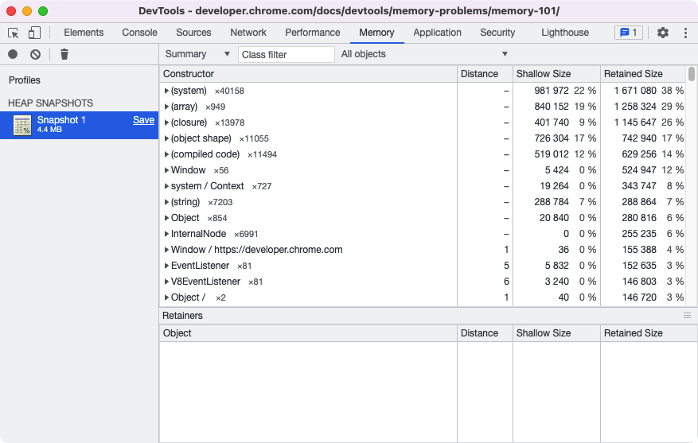
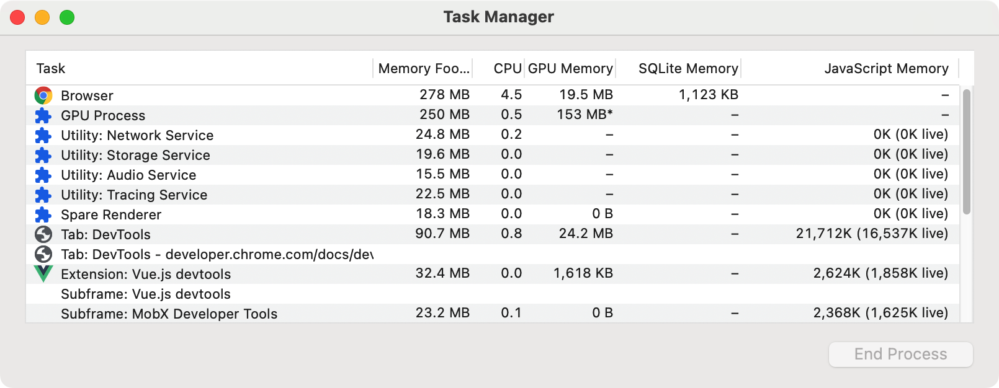

对象在内存中保留的两种方式

- 直接通过对象本身存储
- 隐式地保存对其他对象的引用，从而防止这些对象被垃圾收集器(GC)自动处理

我们可以点击拍摄内存快照获取当时浏览器的内存占用信息。



#待学习 Javascript中的内存管理，学习后查看：[Memory terminology - Chrome Developers](https://developer.chrome.com/docs/devtools/memory-problems/memory-101/)

#待学习 Javascript的三种原始类型数据，number, boolean, string

memory leaks, memory bloat, and frequent garbage collections  
内存泄漏，内存膨胀，频繁的垃圾回收

概要：

- 在Chrome任务管理器查看页面的内存占用
- 用时间轴记录可视化内存使用情况
- 使用堆快照识别分离的DOM树(内存泄漏的常见原因)
- 通过分配时间轴记录找出在JS堆中分配新内存的时间

用户可以从下面的方式感知内存的问题：

- 随着时间的推移，页面的性能会逐渐变差（页面越用越卡，这可能是内存泄漏的症状。内存泄漏是指页面中的错误导致页面随着时间的推移逐渐使用越来越多的内存）
- 页面的性能一直很差（这可能是内存膨胀的症状。内存膨胀是指页面使用的内存超过了最佳页面速度所需的内存。**最佳页面速度所需的内存到底是多少**，和设备的配置有关系，高性能的设备上运行流畅的页面或许在低性能手机上运行就很卡顿，所以就需要找一个平衡点）
- 页面的执行延迟或频繁出现暂停（页面提示未响应，等待等情况。这可能是频繁垃圾收集的症状。垃圾回收是指浏览器回收内存。浏览器决定何时发生这种情况。在收集期间，所有脚本执行都会暂停。因此，如果浏览器经常进行垃圾收集，脚本执行就会经常暂停。）

使用任务管理器监控内存实时占用：



Javascript Memory：

括号里面的值如果在增加，那就是表示在创建新的对象。

使用下面的代码测试内存泄漏

```js
var x = [];

function grow() {
  for (var i = 0; i < 10000; i++) {
    document.body.appendChild(document.createElement('div'));
  }
  x.push(new Array(1000000).join('x'));
}

document.getElementById('grow').addEventListener('click', grow);
```

#继续阅读 [Fix memory problems - Chrome Developers](https://developer.chrome.com/docs/devtools/memory-problems/#visualize_memory_leaks_with_timeline_recordings)

