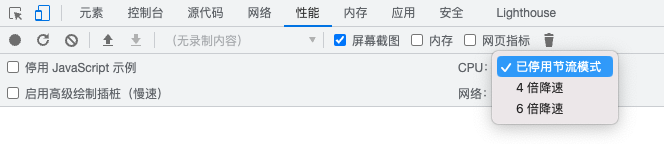

## 设备尺寸

移动模拟视图并不能代表真实的手机运行状态，有一些局限性，例如CPU架构、性能等，如果需要真实的体验，可以尝试远程调试，直接在手机上运行页面。

上图描述了不同设备宽度的示意图，用户在响应模式下，可以拖动模拟器大小来来查看不同设备的效果。对应的尺寸如下：

通过媒体查询面板可以查看代码中定义的对应的样式是否生效，点击对应的区域，下面的模拟器宽度会跟着变化。右键点击浅色的区域可以查看代码中的定义；

蓝色代表最大的宽度，橘色代表最小宽度；

也可以通过菜单修改DPR的值，内置的iPhone的DPR都是固定的，例如iPhone 12的DPR就是3；

## 自定义设备

通过添加自定义的device可以模拟某一些app，有些app中的H5是通过userAgent来判别的。

## 网络和CPU限流

可以通过模拟不同级别的方式观察网页的展示性能，并不是很准确。如果只限制单个，需要在性能面板去操作。

## 页面截图

支持长截图和当前视口的截图。

## 传感器

可以设置定位和设备的屏幕方向。

---
